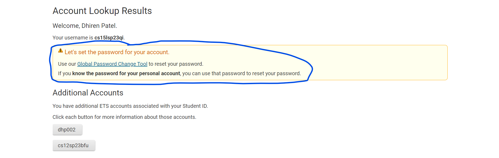
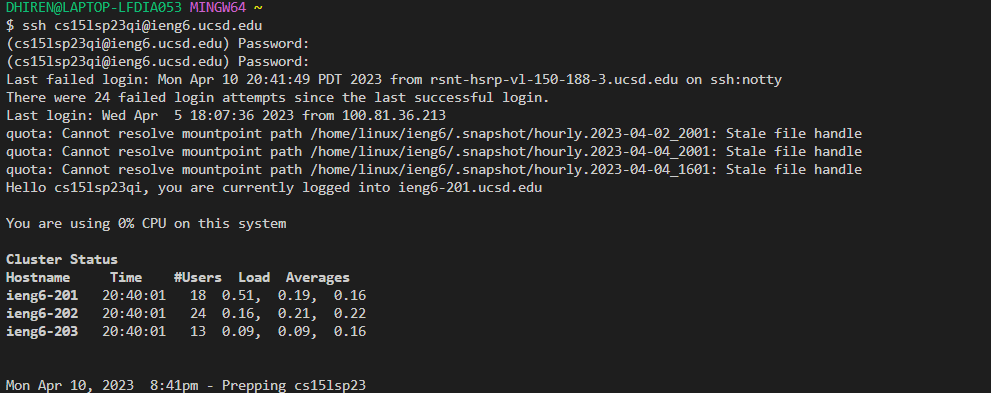
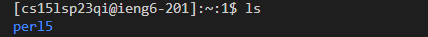
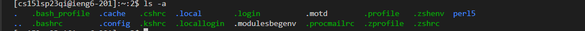

# Hello there prospective (and possibly current) CSE 15L Students!
## Today I will be showing you through the process of Remote Access!
---

## 1. Installing VS Code
For many people taking this class, your professor may have already made you use VS Code for your previous classes, but it is still
good to learn.

Steps:
1. Use this [Link](https://code.visualstudio.com/) to be able to download VS Code onto your computer. Make sure to download the right
one if you are on Windows or MacOS respectively.
2. Once you press the download button and it finishes downloading, click on the download and begin to set up VS Code using the directions
given
3. After doing all the steps required in downloading VS Code, your interface should look something like this:

4. Make sure to have VS Code open for the next portion!
---

## 2. Remotely Connecting
To access the school account that we need we need for the remote login we need to go to this [Site](https://sdacs.ucsd.edu/-icc/indet.php). You need to use your normal AD username and password to be able to access the CSE 15L account.

After Logging in, you should be on this screen:

### Click the area with the red circle that says cs15lsp23xx (the xx is whatever your two last numbers or letters are)

Once you click that, press the Global Password Change Tool to change your password, as your password has not been set just yet

### From there, follow the steps that they take you through and make sure to input the cse15L account that you clicked on before as your username. If you need additional help refer to the [Tutorial](https://drive.google.com/file/d/17IDZn8Qq7Q0RkYMxdiIR0o6HJ3B5YqSW/view) given by the professor

---
## Now we can get onto the next step and trying some commands using the CSE 15L Account and VS Code!

For this portion you need to install the right version of git. For macOS this is mostly not needed but for Windows users you will have to go to this [website](https://git-scm.com/download/win)

After this, we are able to move towards VS Code :
- Go to your terminal and select Git Bash instead of the normal terminal
- Once the dollar sign shows up, you should input ssh (which is Secure Shell) and then input your CSE15l username and then @ieng6.ucsd.edu. 
- After that, it will tell you to input your password. You won't be able to see it for security reasons so make sure to put it in carefully
- PS. There could possibly be some issues when first doing it so make sure to ask for help if needed and refer back to the Professors work on how to do it as well.

## Right now, It should look like this if you login successfully:

---
Now lets try some commands

The first one is ls, which shows the list of contents of the current working directory, whihc is the root location of your current java project.

Another one is ls -a, which shows all of the files in the directory (even the hidden ones), and all of them start with "."

