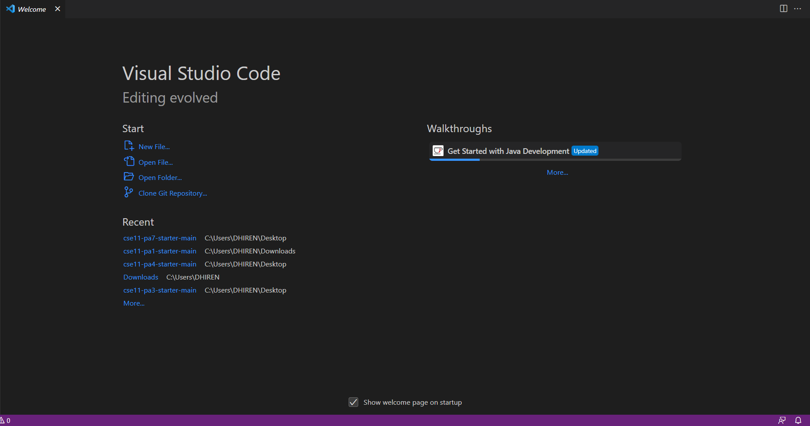
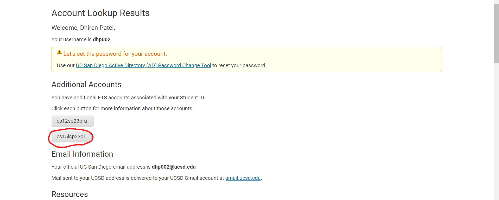

# Hello there prospective (and possibly current) CSE 15L Students!
## Today I will be showing you through the process of Remote Access!
---

## 1. Installing VS Code
For many people taking this class, your professor may have already made you use VS Code for your previous classes, but it is still
good to learn.

Steps:
1. Use this [Link](https://code.visualstudio.com/) to be able to download VS Code onto your computer. Make sure to download the right
one if you are on Windows or MacOS respectively.
2. Once you press the download button and it is finished updating, click on the download and begin to set up vs code using the directions
given
3. After doing all the steps required in downloading VS Code, your interface should look something like this:

4. Make sure to have VS Code open for the next portion!
---

## 2. Remotely Connecting
To access the school account that we need we need for the remote login we need to go to this [Site](https://sdacs.ucsd.edu/-icc/indet.php). You need to use your normal AD username and password to be able to access the CSE 15L account.

After Logging in, you should be on this screen:

### Click the area with the red circle that says cs15lsp23xx (the xx is whatever your two last numbers or letters are)
